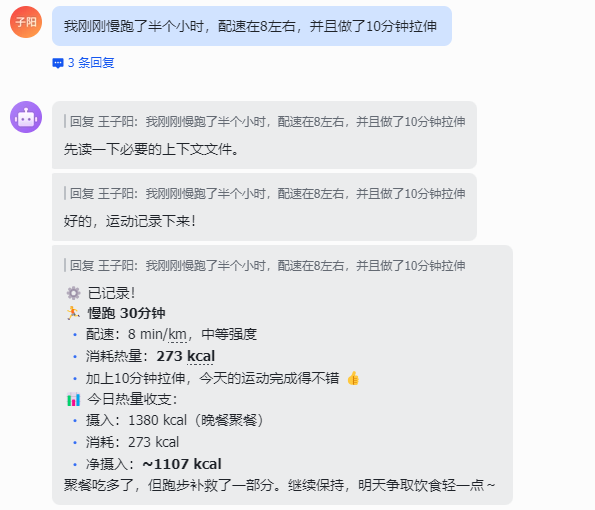
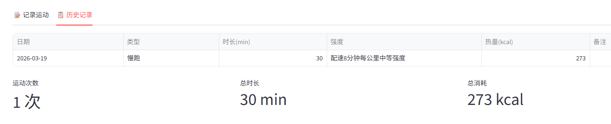
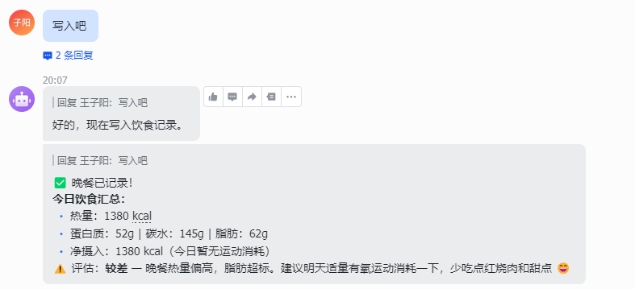
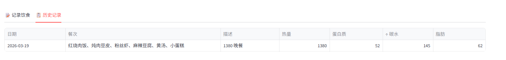
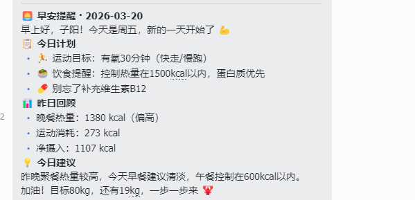
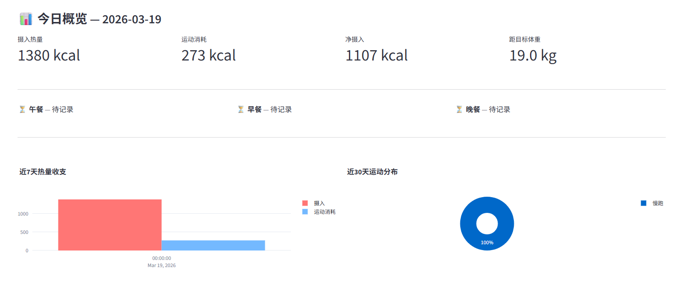
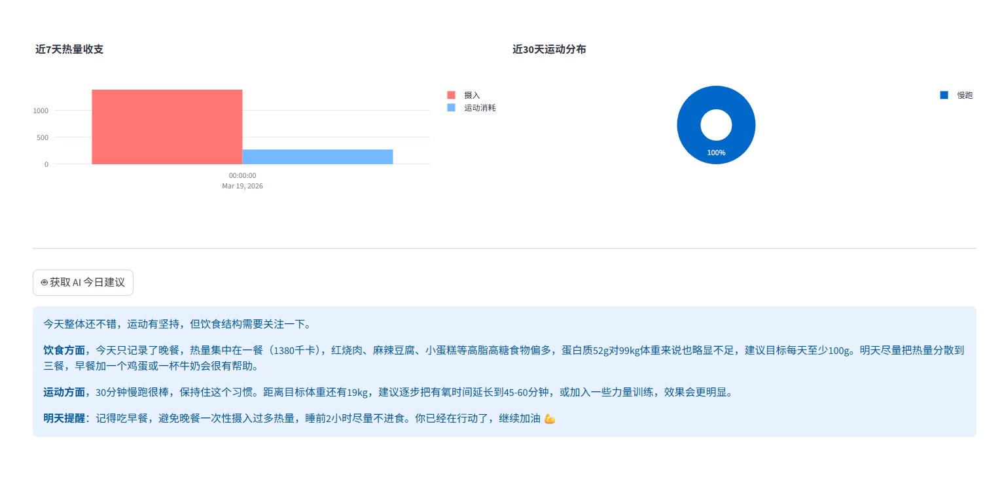

# 🦞 AI 个人助理 — 产品说明文档

---

## 一、产品定位

**AI 个人助理**是一款面向在校学生和职场人士的智能生活管理工具，核心理念是：

> 用 AI 替代繁琐的手动记录与分析，让用户只需"说一句话"，就能完成任务规划、日程安排和健康管理。

本产品将大语言模型（LLM）深度嵌入六大日常场景，不只是"聊天机器人"，而是真正能**存储数据、追踪进度、给出个性化建议**的智能助手。

---

## 二、解决的核心痛点


| 痛点                     | 传统方式           | 本产品方案                                   |
| ------------------------ | ------------------ | -------------------------------------------- |
| 任务太多不知从哪下手     | 手写 to-do，靠自觉 | AI 自动分解为带优先级和时间估算的子任务      |
| 日程记录繁琐             | 手动填表单         | 自然语言输入，AI 自动解析时间地点            |
| 不知道运动消耗了多少热量 | 查表估算，不准确   | AI 结合体重、运动类型、强度精准计算          |
| 不知道吃了多少热量       | 查食物数据库，费时 | 用文字描述一餐，AI 秒出营养成分              |
| 减肥计划难以坚持         | 网上找通用方案     | 基于个人数据（体重/年龄/活动量）生成专属计划 |
| 健康数据分散，看不到全貌 | 各处记录，无法汇总 | 统一数据总览，可视化图表一目了然             |

---

## 三、功能详解

### 💪 功能一：运动记录

**使用场景：** 记录每次运动，了解热量消耗，追踪运动习惯。



**操作流程：**

* 通过飞书与openclaw交互
* 提供本次运动相关信息，自动分析并计入分析数据库当中

**AI 能力：**

- 基于 MET（代谢当量）模型结合个人体重精准估算热量
- 给出针对性运动建议
- 历史记录支持统计：累计次数、总时长、总消耗热量



---

### 🍱 功能二：饮食分析

**使用场景：** 了解每餐的热量和营养成分，辅助饮食管理。

[1773923066808](images/产品说明文档/1773923066808.png)



**操作流程：**

1. 通过飞书与openclaw交互
2. 提供关于本餐数据或照片，openclaw通过视觉理解模型估算大概热量计入数据库

**AI 输出内容：**

- 热量（kcal）
- 蛋白质 / 碳水 / 脂肪（克）
- 营养评价（优/良/一般/较差）
- 个性化饮食建议

历史记录



**联动功能：** 若当天已有运动记录，系统自动显示"今日热量收支"（摄入 - 运动消耗 = 净摄入），帮助用户直观判断当天热量是否超标。

---

### 🎯 功能三：健康目标

**使用场景：** 设定减脂/增肌目标，获取 AI 制定的个性化健康计划。

**操作流程：**

1. 填写当前体重、目标体重、身高、年龄、性别、目标周期、活动水平
2. 保存后 AI 生成专属计划

**AI 输出内容：**

- 每日推荐热量摄入（基于 TDEE 计算）
- 三大营养素分配比例
- 每周运动计划（具体运动类型和时长）
- 饮食原则（3~5 条）
- 注意事项



**数据可视化：** 体重趋势折线图，目标体重虚线标注，进度一目了然。

---

### 📊 功能四：数据总览

**使用场景：** 每日/周期性查看健康数据全貌，掌握整体状态。



**展示内容：**


| 指标         | 说明                      |
| ------------ | ------------------------- |
| 今日摄入热量 | 当天所有餐次热量合计      |
| 今日运动消耗 | 当天所有运动热量合计      |
| 净摄入热量   | 摄入 - 消耗，判断热量盈亏 |
| 距目标体重   | 当前体重与目标的差距      |

**可视化图表：**

- 近 7 天热量收支对比柱状图（摄入 vs 消耗）
- 近 30 天运动类型分布饼图
- 体重趋势折线图

---

## 四、技术架构

```
前端框架：  Streamlit（Python Web UI）
AI 引擎：   OpenAI 兼容 API（支持任意兼容模型，如 GPT-4o、Claude 等）
数据存储：  SQLite 本地数据库（无需服务器，开箱即用）
可视化：    Plotly（交互式图表）
数据处理：  Pandas
```

**数据表结构：**

- `schedules` — 日程记录
- `exercise_logs` — 运动记录
- `diet_logs` — 饮食记录（含 AI 分析结果）
- `weight_logs` — 体重记录
- `health_goals` — 健康目标

所有数据本地存储，**不上传任何个人信息**，隐私安全。

---

## 五、快速启动

**环境要求：** Python 3.8+

```bash
# 安装依赖
pip install -r requirements.txt

# 配置 API（复制并编辑 .env 文件）
cp .env.example .env

# 启动应用
streamlit run app.py
```

浏览器访问 `http://localhost:8501` 即可使用。

**API 配置（.env）：**

```
OPENAI_API_KEY=你的API密钥
OPENAI_BASE_URL=https://api.openai.com/v1
OPENAI_MODEL=gpt-4o
```

> 支持任意 OpenAI 兼容接口，可替换为国内模型服务。

---

## 六、产品亮点总结

1. **零门槛交互** — 全程自然语言输入，无需学习任何操作规范
2. **AI 深度集成** — 不只是展示，AI 真正参与计算、分析、规划
3. **数据闭环** — 运动与饮食数据互相联动，热量收支实时可见
4. **个性化** — 所有建议基于用户真实数据，非通用模板
5. **本地优先** — SQLite 存储，无需注册账号，数据完全自主
6. **轻量部署** — 单文件应用，`pip install` + `streamlit run` 即可运行

---

*文档版本：v1.0 | 2026-03-19*
